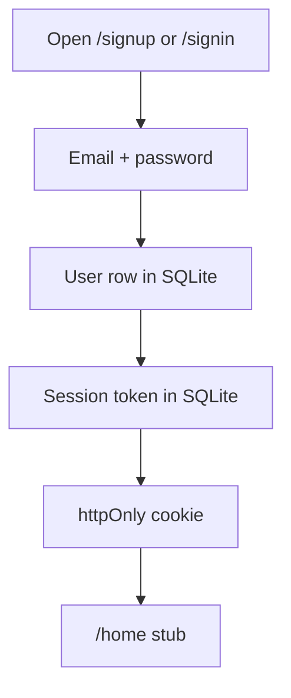

# Phase 1 — Own-DB auth

**Status:** complete for phase 1.  
**Who it is for:** anyone who opens Agily.  
**What it unlocks:** a signed-in session. No teams until phase 2.

## Intro

This is the front door. Agily is a multi-user planner, so tickets later are private to a team. Phase 1 does not create teams. It answers: is this person in our `User` table, and do they hold a live row in `Session`?

There is no OAuth, no Auth SaaS, no Google. Email is a unique login key stored in SQLite. Passwords are bcrypt hashes. We issue an httpOnly cookie named `agily_session` whose value is a random token we also store.

## Why this phase exists

Without our own sessions, later screens cannot trust who is acting. Cloud identity would break the hard rule: data lives in **our app + our SQLite**.

## What you see

| Person | After they authenticate |
|--------|-------------------------|
| New | `/signup` then `/home` — “No team yet” |
| Returning | `/signin` then `/home` |
| Signed out | `/signin` |

The sign-in surface is one field group on ink, copper accent, large type. No “Welcome to your app.”

## How a session works

1. They submit name (sign up), email, and password.
2. We hash the password (`bcrypt`, 12 rounds) and insert `User`.
3. We insert `Session` with a 32-byte hex token and a 30-day expiry.
4. Cookie `agily_session` is httpOnly, SameSite=Lax, Path=/, Secure only in production.
5. `/home` calls `requireUser()`. Missing or expired token → `/signin`.
6. Sign out deletes the session row and clears the cookie.

## Examples

- Two people sign up. Both emails exist in `User`. Zero identity providers.
- Wrong password: “Email or password is wrong.” No session cookie.
- Sign out, then open `/home`: redirected to `/signin`.

## Not in this phase

Teams, invites, tickets, Ollama, filter lenses, four views.

## Code

`src/lib/auth/` · `src/lib/db/prisma.ts` · `prisma/schema.prisma` · `src/app/(auth)/` · `src/app/(studio)/home`

[All phases](README.md)
