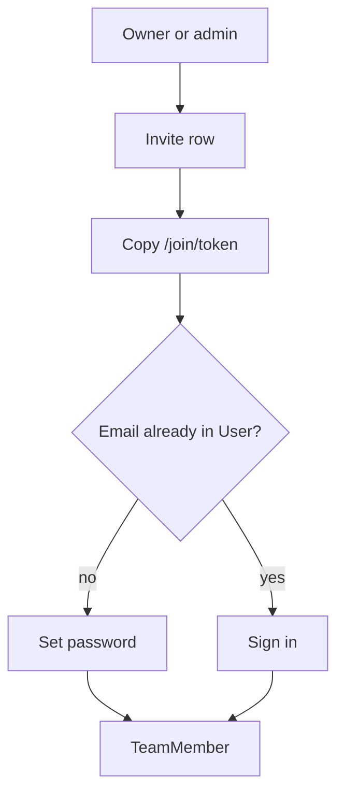

# Phase 2 — Teams + copy-link invites

**Status:** complete for phase 2.  
**Who it is for:** the person who starts a studio, and the people they invite.  
**What it unlocks:** a team, four access levels, join by copied link. No tickets yet.

## Intro

Phase 1 only knew *who you are*. Phase 2 knows *where you work*. A user can belong to many teams. The first owner is whoever starts the studio — on signup they pick **Owner** and name it, or later from `/home`.

Invites never send mail. An owner or admin (or a member, if the studio setting allows) types a teammate **email** (login key), picks access, and copies `/join/[token]`.

## Access levels

| Role | Signup | What they can do |
|------|--------|------------------|
| Owner | Self, by starting a studio | Delete team, all settings, any people except the last owner |
| Admin | Granted by an owner (not a signup pick) | Settings, invite, change member/viewer |
| Member | Signup wait-for-link, or invite | Write later; invite if `membersCanInvite` |
| Viewer | Signup wait-for-link, or invite | Read only |

## How a join link works

1. People screen: email + role → `Invite` row + token.
2. Admin pastes `http://127.0.0.1:43123/join/[token]` in chat.
3. New email: set password. Existing email: sign in, then join.
4. Token dies after 14 days, or when accepted.

## Not in this phase

Projects, tickets, four views, Ollama.

## Code

`src/lib/rbac/roles.ts` · `src/lib/teams/` · `src/app/(studio)/t/` · `src/app/join/`

[All phases](README.md)
