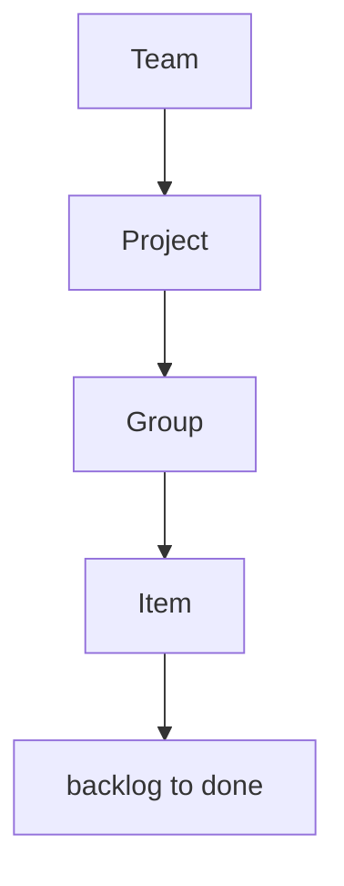

# Phase 3 — Projects, groups, items

**Status:** complete for phase 3.  
**Who it is for:** anyone in a studio who plans work.  
**What it unlocks:** one board, sections, tickets. Four views later reuse these rows.

## Intro

A **Project** is a board. A **Group** is a Monday-like section (`Now`, `Next`, `Later` on create). An **Item** is the only ticket: title, markdown body, status, optional due date.

Status is one set for every future view: `backlog → ready → doing → review → done`.

## Why this phase exists

Without a single item model, Ledger and Flow would drift. Phase 3 writes the rows. Phase 5 only changes chrome.

## What you see

| Person | Can do |
|--------|--------|
| Owner / admin | Create boards, archive, write tickets |
| Member | Write tickets; create boards if `membersCanCreateProjects` |
| Viewer | Read the board |

Mobile: sections stack. Desktop: same cards, more air.

## How a ticket is born

1. Open a board (or create one).
2. Groups exist (`Now` / `Next` / `Later`).
3. Add a ticket in a section. Status starts at `backlog`.
4. Save title, status, due, body — still the same `Item` row.

## Not in this phase

Assignees, Ledger/Flow/Orbit/Pulse chrome, focus stage, Lens, Playwright.

## Code

`src/lib/items/` · `src/app/(studio)/t/[slug]/p/` · `prisma/schema.prisma`

[All phases](README.md)
