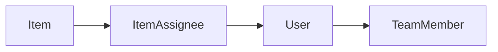

# Phase 4 — People + assign

**Status:** complete for phase 4.  
**Who it is for:** anyone who writes a ticket.  
**What it unlocks:** named people on the same `Item` row. No extra ticket copies.

## Intro

Phase 3 stored work. Phase 4 names who holds it. `ItemAssignee` is a join table: many people on one ticket, one person on many tickets. Assignees must already be on the team. Viewers can see marks; they cannot change them.

## Why this phase exists

Pulse (phase 5) needs “mine.” Without assignees, that stream is empty. Assignment lives on the ticket, not on a kanban card clone.

## What you see

- Board: checkboxes for each teammate, **Assign me** / **Unassign me**
- New ticket: optional **Assign me**
- People: ticket counts next to each email
- Viewer: initials only

## Not in this phase

Four views, lenses, comments, Playwright.

## Code

`src/lib/items/assign.ts` · `src/lib/items/actions.ts` · `src/components/items/item-row.tsx`

[All phases](README.md)
