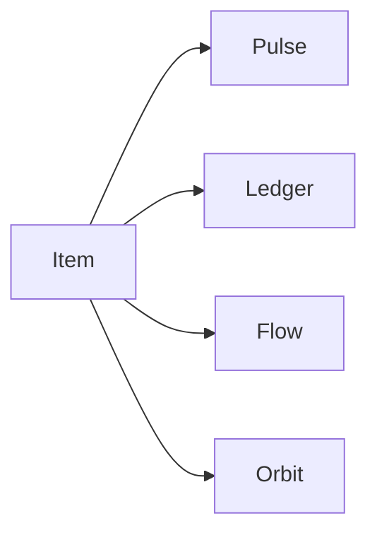

# Phase 5 — Four views

**Status:** complete on branch `phase-5-four-views`, then merged to `main`.  
**Who it is for:** anyone opening a studio in the morning, or a board during the day.  
**What it unlocks:** Pulse, Ledger, Flow, Orbit — **same `Item` rows**.

## Intro

Phase 3 stored tickets. Phase 4 named people. Phase 5 only changes chrome. Ledger is a sparse table. Flow is a status river. Orbit is a month from `dueOn` plus an unscheduled lane. Pulse is a stream: mine, overdue, recently assigned.

## Why this phase exists

Without four views on one model, someone would copy rows into a kanban table. That is forbidden.

## What you see

| View | Where |
|------|--------|
| Pulse | `/t/[slug]` — mine / overdue / recently assigned |
| Ledger | `/t/[slug]/p/[board]` — sections, full tickets |
| Flow | `?view=flow` — horizontal status columns |
| Orbit | `?view=orbit&ym=2026-09` — month + unscheduled |

Mobile: Pulse as lists, Flow scrolls sideways, Ledger stacks.

## Not in this phase

Saved filter lenses, focus stage, Playwright.

## Code

`src/lib/views/views.ts` · `src/components/views/` · `src/app/(studio)/t/`

[All phases](README.md)
