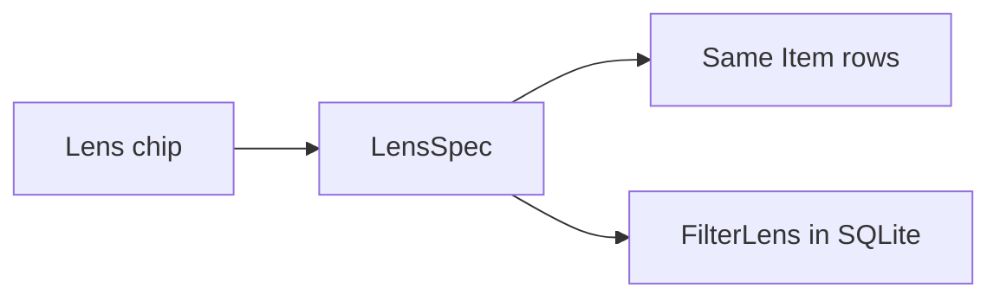

# Phase 6 — Filter lenses

**Status:** complete on branch `phase-6-filter-lenses`, then merged to `main`.  
**Who it is for:** anyone scanning a board who wants one tap, not a filter modal.  
**What it unlocks:** saved chips **per person per studio**, on the same `Item` rows.

## Intro

Phase 5 changed chrome. Phase 6 only changes which rows show. Built-in chips: Mine, Overdue, Unassigned, This week, a person, a status. Stack them. Name the stack and keep it — that row lives in our SQLite as `FilterLens`.

## Why this phase exists

Without first-class chips, people copy a board or open a modal. Saving a lens is easier than a filter builder.

## What you see

| Chip | Meaning |
|------|---------|
| All | Every ticket on the board |
| Mine / Overdue / Unassigned / This week | One kind, tap again to clear |
| Status | Backlog → Done |
| Person | Anyone already on the studio |
| Kept name | Your saved spec |

Ledger, Flow, and Orbit share the query (`?q=`, `?status=`, `?who=`, or `?lens=`). Viewers can keep chips; they still cannot write tickets.

## Not in this phase

Focus stage, in-app bell, Playwright.

## Code

`src/lib/lenses/` · `src/components/lenses/` · `FilterLens` in `prisma/schema.prisma`

[All phases](README.md)
