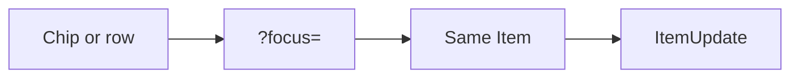

# Phase 7 — Focus stage + comments

**Status:** complete on branch `phase-7-focus-stage`, then merged to `main`.  
**Who it is for:** anyone who wants one ticket in the air, not a cramped row.  
**What it unlocks:** desktop stage, mobile drawer, notes on the same `Item`.

## Intro

Phase 6 filtered rows. Phase 7 opens one. Ledger stays compact. Flow and Orbit chips, and Pulse, open `?focus=`. The board dims. Notes live in `ItemUpdate` — our SQLite, no email.

## Why this phase exists

Without a stage, people edit in a dense row or invent a second ticket page. One card. Same row.

## What you see

| Surface | Chrome |
|---------|--------|
| Desktop | Centered card over a dim board |
| Mobile | Bottom drawer |
| Notes | Chronological thread under the ticket |
| Close | Backdrop, Close, or Esc |

Viewers read. Members write notes. Lenses stay on the URL when the stage opens.

## Not in this phase

In-app bell, Ollama Lens, Playwright.

## Code

`src/lib/focus/` · `src/components/focus/` · `ItemUpdate` in `prisma/schema.prisma`

[All phases](README.md)
