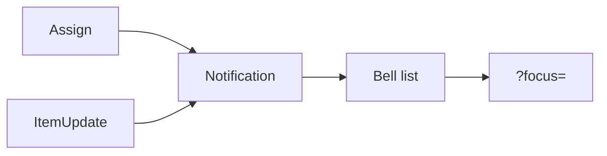

# Phase 8 — In-app bell

**Status:** complete on branch `phase-8-in-app-bell`, then merged to `main`.  
**Who it is for:** anyone who is assigned a ticket or gets a note while they are in another view.  
**What it unlocks:** `Notification` rows in our SQLite. No email.

## Intro

Phase 7 wrote notes on the ticket. Phase 8 tells the other people. Assign and notes write a row. The bell on the rail, the phone header, and `/t/[slug]/notices` read those rows. Opening a notice marks it read and jumps to `?focus=`.

## Why this phase exists

Without our own table, someone would add SMTP or a cloud push. Forbidden.

## What you see

| Event | Who gets a row |
|-------|----------------|
| Someone assigns you | You, not the actor |
| Someone leaves a note | Current assignees, not the author |

Tap the bell. Unread is copper. Mark all read is on the list.

## Not in this phase

Ollama Lens, Playwright, email.

## Code

`src/lib/notices/` · `src/components/chrome/notice-bell.tsx` · `Notification` in `prisma/schema.prisma`

[All phases](README.md)
