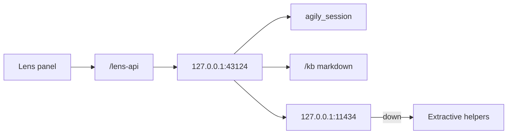

# Phase 9 — Lens AI + Turborepo

**Status:** complete on branch `phase-9-lens-turbo`, then merged to `main`.  
**Who it is for:** anyone who wants a rewrite of a title, a board count, or a KB answer without leaving this machine.  
**What it unlocks:** Express on loopback, shared `@agily/lens`, Ollama on `127.0.0.1` only, and `/kb`.

## Intro

Phases 1–8 stay a Next app at the repo root. Phase 9 wraps that app in a Turborepo: `apps/api` is Express, `packages/lens` is the Prisma-free helpers, and Next still serves the studio. The session cookie is the same `agily_session` — not JWT.

If Ollama is down, Lens still answers from board counts and the bundled markdown.

## Why this phase exists

A paid cloud model would break the local-only rule. A GraphQL/JWT rewrite of phases 1–8 would too. Loopback Ollama plus extractive fallback is the product.

## What you see

| Surface | What happens |
|---------|----------------|
| Rail / header **Lens** | Zustand panel. Ask. Same cookie. |
| `/kb` | Bundled markdown. No CMS. |
| Ollama up | Rewrite from `llama3.2:3b` (or `OLLAMA_MODEL`) |
| Ollama down | Board counts + KB snippets + install hint |

## Not in this phase

JWT, GraphQL, Playwright, shipping keyboard chrome.

## Code

`packages/lens` · `apps/api` · `kb/` · `src/components/lens/` · `turbo.json`

[All phases](README.md)
