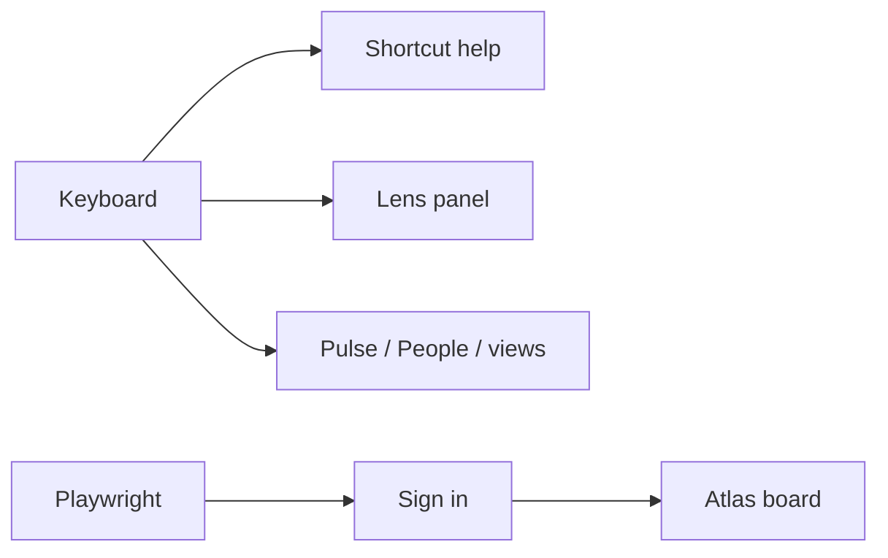

# Phase 10 — Ship chrome

**Status:** complete on branch `phase-10-ship-chrome`, then merged to `main`.  
**Who it is for:** anyone who lives in the studio all day and wants muscle memory, clear empty states, and regression tests.  
**What it unlocks:** keyboard sheet, friendly 404/error pages, Playwright smoke.

## Intro

Phases 1–9 built the product. Phase 10 makes it feel finished: `?` opens shortcuts, empty lists read calmly, broken routes do not white-screen, and Playwright walks sign-in → Pulse → board.

## Why this phase exists

Without keyboard chrome, power users hunt the rail. Without Playwright, every phase after 9 is manual. Without empty/error pages, the app feels like a demo.

## What you see

| Surface | Chrome |
|---------|--------|
| `?` | Shortcut sheet (Esc closes) |
| `/` or `l` | Toggle Lens |
| `g` then `p` / `e` / `h` | Pulse / People / studios |
| `1` `2` `3` on a board | Ledger / Flow / Orbit |
| Empty bell / boards | Dashed empty state |
| Unknown studio | `not-found` page |
| Runtime error | `error.tsx` with Try again |

## Not in this phase

Cloud deploy, JWT rewrite, GraphQL, paid AI.

## Code

`src/lib/chrome/keyboard.ts` · `src/components/chrome/` · `e2e/` · `playwright.config.ts` · `prisma/seed.ts`

[All phases](README.md)
